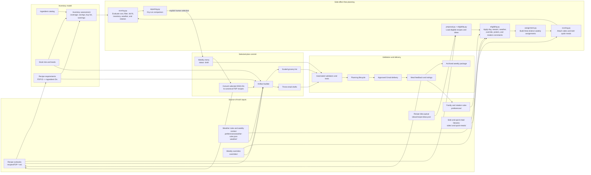
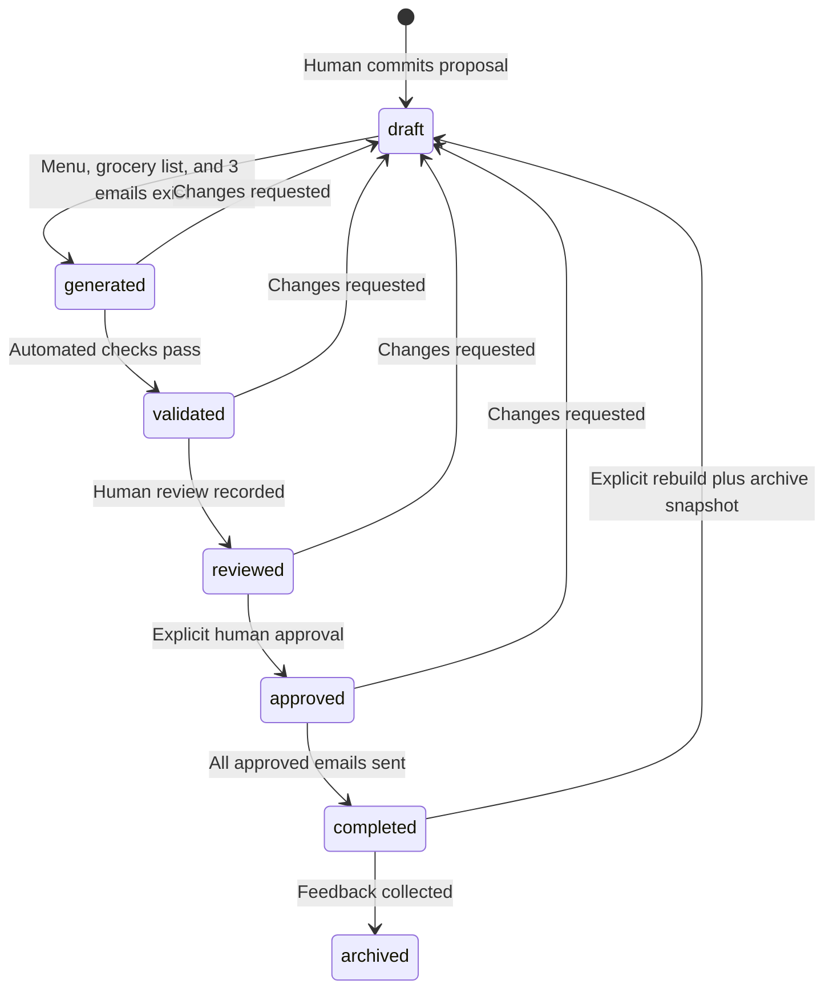

# System Architecture

The Family Dinner Planner is a file-backed planning system. Version-controlled
Markdown and JSON files are the database; Python scripts provide domain logic;
PowerShell GUIs provide local interaction; generated menus, grocery lists, and
email files are derived artifacts.

## Component Flow

## Source-of-Truth Boundaries

| Concern | Authoritative data | Derived consumers |
| --- | --- | --- |
| Recipe identity and instructions | `recipes/FDP-*.md` | Dry runs, menus, emails, feedback |
| Recipe discovery | `recipes/index.md` | Humans and importer; recipe files remain authoritative |
| Unresolved meal concepts | `ideas/recipe-ideas.json` | Dry-run candidate pool |
| Ingredient identity and units | `inventory/catalog.json` | Inventory UI, assessment, grocery generation |
| On-hand food | `inventory/stock.json` | Coverage, FIFO, savings, buy list |
| Recipe ingredient demand | `inventory/recipe-requirements.json` | Proposal scoring and grocery generation |
| Family policy | `preferences/` and `AGENTS.md` | Generator, automation, human review |
| Forecast policy and weekly classification | `preferences/weather-rules.json`, `weather/` | Eligibility, scoring, menu summary |
| Human schedule exceptions | `overrides/<year>/*-overrides.json` | Dry runs, menu rebuilds, grocery deltas |
| Planning state | Weekly menu TOML and status history | Lifecycle validator and delivery workflow |
| Sent-message record | Menu history and `memory.md` | Audit and resend prevention |

Generated files under `menus/`, `grocery-lists/`, and `email-outputs/` are
rebuildable views. They should not become independent sources of recipe or
inventory truth.

Every top-level JSON source document declares `schema_version`. Version `1` is
currently supported. Domain validators reject missing, malformed, or
unsupported versions before a future migration changes the document shape.

## Planning Pipeline

The `planner/` package separates planning responsibilities while
`scripts/dry_run.py` remains the stable command-line and compatibility facade.

| Module | Responsibility |
| --- | --- |
| `planner/constants.py` | Shared limits, day names, methods, and project root |
| `planner/eligibility.py` | Recipe loading, season and override constraints, recent history, and inventory matching |
| `planner/assignment.py` | Constrained weekly assignment search and option diversity |
| `planner/scoring.py` | Proposal enrichment, metrics, warnings, and per-meal explanations |
| `planner/proposal.py` | Recipe-idea pools and three-option proposal orchestration |
| `planner/reporting.py` | Human-readable dry-run comparison output |
| `planner/commit.py` | Explicit selection persistence and idea canonicalization |
| `scripts/dry_run.py` | Backward-compatible imports and command-line entry point |

### 1. Load and Normalize

`planner/proposal.py` coordinates loading canonical recipes, queued user ideas,
and ephemeral idea pools. `planner/eligibility.py` loads recent meal history
and weekly overrides. Scoring loads inventory requirements, weather context,
side dishes, and kids' quick meals. Optional recipe fields receive safe
defaults during loading.

### 2. Constrain Assignments

The constrained assignment search enforces:

- Monday and low-effort day rules unless a human override fixes that day.
- Season compatibility and weather exclusions.
- The weather category's minimum heat-friendly meal count.
- No protein more than three times per week.
- No duplicate recipe within one proposal.
- No more than two queued ideas in one proposal.
- At most two shared non-fixed recipe or idea IDs between options.

Fixed overrides are requirements. They are present in every option but are not
counted as option overlap.

When assignment search fails, it emits structured diagnostics with candidate
counts for each day and unique recipe IDs rejected by the protein, uniqueness,
queued-idea, option-overlap, weather, and heat-friendly constraints. The CLI
formats these diagnostics for the dry-run GUI while preserving the structured
payload on `ProposalGenerationError` for tests and future interfaces.

### 3. Enrich and Score

`evaluate_proposal()` adds two sides to entree-only recipes, adds a quick meal
when a child alternative is required, aggregates inventory demand, and reports:

- Estimated menu and post-inventory shopping cost.
- Inventory coverage, savings, purchases, and warnings.
- Fiber and effective kid-friendly score.
- Recipe rotation score and recent repeats.
- Weather category and heat-friendly meal count.
- Per-recipe selection explanations, including inventory coverage, expiring
  refrigerated stock, day-rule fit, recent rotation, weather fit, and kid score.
- Blocking errors and review warnings.

Dry run is read-only. It does not write menus, groceries, emails, history,
recipes, or inventory.

### 4. Commit and Canonicalize

`apply_proposal()` persists only the explicitly selected option and creates a
weekly menu at `draft`. Any selected `IDEA-*` entry must then become a complete,
validated `FDP-*` candidate with inventory requirements before the week can
advance.

### 5. Build Weekly Artifacts

`scripts/build_week_artifacts.py` accepts the final seven IDs plus per-day diner
counts. It:

1. Expands canonical recipe cards into dated menu sections.
2. Preserves alternate and custom override audit notes.
3. Adds side dishes and kids' quick meals.
4. Scales inventory requirements by planned diners.
5. Applies stock, expiration, fresh-produce, FIFO, and consumable rules.
6. Writes a consolidated grocery list.
7. Writes the three Monday-Tuesday, Wednesday-Friday, and Saturday-Sunday email
   files.
8. Recalculates weather, cost, fiber, inventory, and candidate summaries.

## Planning Lifecycle

`scripts/menu_status.py` owns legal transitions, status timestamps, and the
append-only status history. Human states cannot be attributed to an automated
actor.

## Validation Gates

| Validator | Responsibility |
| --- | --- |
| `validate_recipes.py` | Recipe structure, metadata, semantic rules, references, and card consistency |
| `inventory.py validate` | Catalog, stock lots, units, expiration data, and FDP requirement coverage |
| `recipe_ideas.py validate` | Idea IDs, statuses, metadata, and conversion references |
| `side_dishes.py validate` | Side IDs, nutrition metadata, and inventory references |
| `quick_meals.py validate` | Kid alternative IDs, costs, scores, and inventory references |
| `weather_context.py validate` | Weather categories, thresholds, weekly files, and sources |
| `meal_override.py validate` | Day uniqueness, types, and original/replacement IDs |
| `menu_status.py check-all` | Lifecycle metadata and transition history |
| `tests/` | Cross-component behavior and regression coverage |

GitHub Actions runs these checks on pushes and pull requests. Passing structural
validation does not replace human review of taste, quantities, household
availability, or whether a candidate recipe is genuinely family-approved.

## User Interfaces and Automation

- `Plan Week.cmd` launches the dry-run comparison GUI.
- `Import Recipe.cmd` imports candidates and saves ideas.
- `Kitchen Inventory.cmd` edits stock and consumable levels.
- `Override Meal.cmd` records audited schedule changes.
- `Review Meal.cmd` collects post-meal feedback.
- The Saturday automation reads the same files and invokes the same validators
  and dry-run engine; it does not maintain a separate planning model.

## Extension Rules

New capabilities should enter through explicit data contracts and validators:

1. Add stable IDs and schema fields to source data.
2. Validate them independently.
3. Integrate them into assignment constraints or proposal scoring.
4. Carry them through artifact generation.
5. Add focused tests and a CI validation step.

This keeps the planner deterministic, reviewable, and safe to regenerate.
