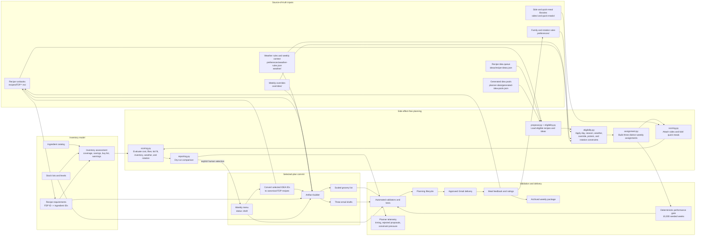
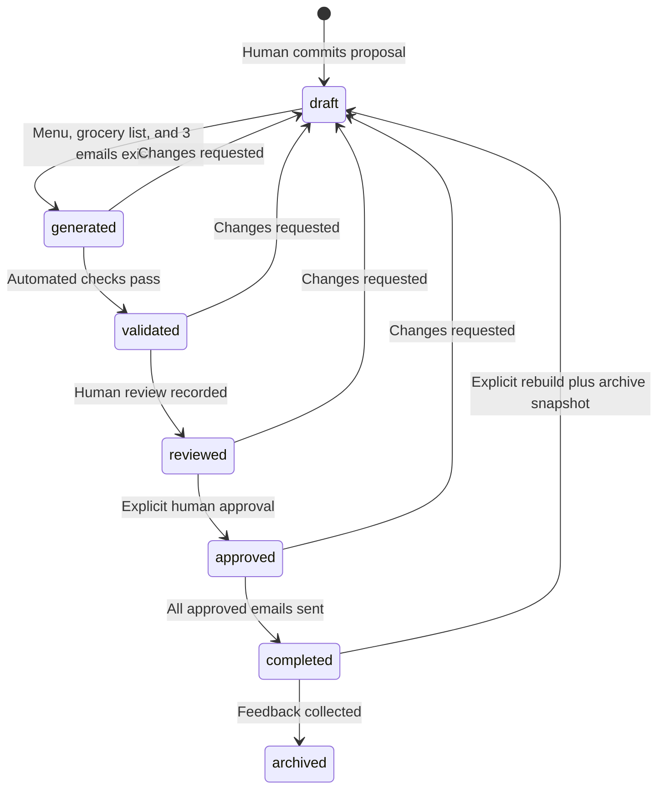

# System Architecture

The Family Dinner Planner is a file-backed planning system. Version-controlled
Markdown and JSON files are the database; Python scripts provide domain logic;
the PowerShell Planning Suite provides a shared desktop entry point to the
workflow GUIs; generated menus, grocery lists, and email files are derived
artifacts.

## Component Flow

## Source-of-Truth Boundaries

| Concern | Authoritative data | Derived consumers |
| --- | --- | --- |
| Recipe identity and instructions | `recipes/FDP-*.md` | Dry runs, menus, emails, feedback |
| Recipe discovery | `recipes/index.md` | Humans and importer; recipe files remain authoritative |
| Unresolved meal concepts | `ideas/recipe-ideas.json` | Dry-run candidate pool |
| Generated fallback candidates | `planner-data/generated-idea-pools.json` | Dry-run candidate generation |
| Planning rule registry | `planner-data/planning-rules.json` | Trace instrumentation, tests, and monthly rule coverage |
| Ingredient identity and units | `inventory/catalog.json` | Inventory UI, assessment, grocery generation |
| On-hand food | `inventory/stock.json` | Coverage, FIFO, savings, buy list |
| Recipe ingredient demand | `inventory/recipe-requirements.json` | Proposal scoring and grocery generation |
| Family policy | `preferences/` and `AGENTS.md` | Generator, automation, human review |
| Forecast policy and weekly classification | `preferences/weather-rules.json`, `weather/` | Eligibility, scoring, menu summary |
| Human schedule exceptions | `overrides/<year>/*-overrides.json` | Dry runs, menu rebuilds, grocery deltas |
| Planning state | Weekly menu TOML and status history | Lifecycle validator and delivery workflow |
| Sent-message record | Menu history and `memory.md` | Audit and resend prevention |
| Planner operational history | `telemetry/planner-telemetry.json` | CLI telemetry, recipe utilization, and engine maintenance |
| Approved performance policy | `planner-data/performance-baseline.json` | Deterministic simulation and GitHub Actions regression gate |

Generated files under `menus/`, `grocery-lists/`, and `email-outputs/` are
rebuildable views. They should not become independent sources of recipe or
inventory truth.

Every top-level JSON source document declares `schema_version`. Version `1` is
currently supported. Domain validators reject missing, malformed, or
unsupported versions before a future migration changes the document shape.

## Planning Pipeline

The `planner/` package separates planning responsibilities.
`scripts/planner_cli.py` is the command-line entry point, while
`scripts/dry_run.py` remains a backward-compatible wrapper.

| Module | Responsibility |
| --- | --- |
| `planner/constants.py` | Shared limits, day names, methods, and project root |
| `planner/eligibility.py` | Recipe loading, season and override constraints, recent history, and inventory matching |
| `planner/assignment.py` | Constrained weekly assignment search and option diversity |
| `planner/tracing.py` | Versioned per-day filter, ranking, rejection, and selection traces |
| `planner/explainability.py` | Candidate-level selected/rejected decisions, reason codes, and coverage scoring |
| `planner/rules.py` | Planning rule registry validation and monthly coverage reporting |
| `planner/telemetry.py` | Aggregate timing, constraint pressure, recipe utilization, and recommendation drift |
| `planner/simulation.py` | Seeded multi-week scenario simulation using the production assignment engine |
| `planner/performance_gate.py` | Baseline validation and objective simulation metric comparisons |
| `planner/inventory_mapping.py` | Ingredient-mapping completeness and invalid catalog-reference reporting |
| `planner/recipe_editor.py` | Guardrailed imported-recipe metadata and card revisions with validation and rollback |
| `planner/scoring.py` | Proposal validation and orchestration |
| `planner/metrics.py` | Pure cost, fiber, kid-fit, inventory-demand, and rotation calculations |
| `planner/explanations.py` | Per-meal selection explanations and expiring-inventory context |
| `planner/side_planning.py` | Side selection, requirements, and public payload shaping |
| `planner/quick_meal_planning.py` | Kids' quick-meal selection, requirements, and public payload shaping |
| `planner/proposal.py` | Generated/user idea loading and three-option proposal orchestration |
| `planner/reporting.py` | Human-readable dry-run comparison output |
| `planner/commit.py` | Explicit selection persistence and idea canonicalization |
| `planner/week_workflow.py` | Review-package generation, human-readable views, approval, SMTP delivery, and retry receipts |
| `planner/dashboard_status.py` | Read-only validation, simulation, recipe, inventory, menu, and backup health aggregation |
| `scripts/planner_cli.py` | Command parsing and planner operation dispatch |
| `scripts/dashboard_status.py` | JSON/text operational-status entrypoint for the suite dashboard |
| `scripts/week_workflow.py` | Plan Week lifecycle and delivery command entrypoint |
| `scripts/dry_run.py` | Backward-compatible imports and direct-execution wrapper |
| `scripts/meal-planner-suite.ps1` | Shared dashboard and launcher for the four desktop workflow GUIs |

Simulation output uses `average_recipe_cost_usd` for the average sum of recipe
estimates per successful week. The legacy alias `average_grocery_bill_usd`
contains the same value for compatibility; it is not a post-inventory shopping
cost. See [Planner Simulation](simulation.md) for sampling, cache, metric, and
performance-gate semantics.

### 1. Load and Normalize

`planner/proposal.py` coordinates loading canonical recipes, queued user ideas,
and ephemeral idea pools. `planner/eligibility.py` loads recent meal history
and weekly overrides. Scoring loads inventory requirements, weather context,
side dishes, kids' quick meals, and the Monday-through-Sunday diner schedule.
Recipe and side costs and inventory quantities scale from their base servings
to each day's planned diners. Optional recipe fields receive safe defaults
during loading.

When fewer than seven canonical recipes are active, generated ideas supplement
the canonical library rather than replace it. Known recipes and generated
candidates compete under the same assignment constraints.

### 2. Constrain Assignments

The constrained assignment search enforces:

- Monday and low-effort day rules unless a human override fixes that day.
- Season compatibility and weather exclusions.
- The weather category's minimum heat-friendly meal count.
- No protein more than three times per week.
- No duplicate recipe within one proposal.
- No more than two queued ideas in one proposal.
- At most two shared non-fixed recipe or idea IDs between options.

Fixed overrides are requirements. They are present in every option but are not
counted as option overlap.

When assignment search fails, it emits structured diagnostics with candidate
counts for each day and unique recipe IDs rejected by the protein, uniqueness,
queued-idea, option-overlap, weather, and heat-friendly constraints. The CLI
formats these diagnostics for the dry-run GUI while preserving the structured
payload on `ProposalGenerationError` for tests and future interfaces.

Every successful proposal also carries a versioned `planning_trace`. It records
per-day static filter counts, inventory ranking, dynamic constraint removals,
candidate outcomes, solver attempts, search order, and the final selected
recipe. `static_candidates_considered` counts candidates represented in the
per-day static traces, while `search_candidate_attempts` counts recursive solver
attempts. This trace is rendered in the CLI and GUI dry-run reports.

Each traced candidate receives a stable `Selected` or `Rejected` decision,
reason code, and human-readable reason. The trace reports an explainability
score equal to the percentage of candidate decisions with a reason.

### 3. Enrich and Score

`evaluate_proposal()` adds two sides to entree-only recipes, adds a quick meal
when a child alternative is required, aggregates inventory demand, and reports:

- Estimated menu and post-inventory shopping cost.
- Inventory coverage, savings, purchases, and warnings.
- Fiber and effective kid-friendly score.
- Recipe rotation score and recent repeats.
- Weather category and heat-friendly meal count.
- Per-recipe selection explanations, including inventory coverage, expiring
  refrigerated stock, day-rule fit, recent rotation, weather fit, and kid score.
- Blocking errors and review warnings.

Dry run is read-only. It does not write menus, groceries, emails, history,
recipes, or inventory.

### 4. Commit and Canonicalize

`apply_proposal()` persists only the explicitly selected option and creates a
weekly menu at `draft`. Any selected `IDEA-*` entry must then become a complete,
validated `FDP-*` candidate with inventory requirements before the week can
advance.

### 5. Build Weekly Artifacts

`scripts/build_week_artifacts.py` accepts the final seven IDs plus per-day diner
counts. It:

1. Expands canonical recipe cards into dated menu sections.
2. Preserves alternate and custom override audit notes.
3. Adds side dishes and kids' quick meals.
4. Scales inventory requirements by planned diners.
5. Applies stock, expiration, fresh-produce, FIFO, and consumable rules.
6. Writes a consolidated grocery list.
7. Writes the three Monday-Tuesday, Wednesday-Friday, and Saturday-Sunday email
   files.
8. Recalculates weather, cost, fiber, inventory, and candidate summaries.
9. Preserves the committed **Why This Menu** rationale in readable and email
   artifacts.

## Planning Lifecycle

`scripts/menu_status.py` owns legal transitions, status timestamps, and the
append-only status history. Human states cannot be attributed to an automated
actor.

## Validation Gates

| Validator | Responsibility |
| --- | --- |
| `validate_recipes.py` | Recipe structure, metadata, semantic rules, references, and card consistency |
| `inventory.py validate` | Catalog, stock lots, units, expiration data, and FDP requirement coverage |
| `recipe_ideas.py validate` | Idea IDs, statuses, metadata, and conversion references |
| `generated_idea_pools.py validate` | Generated candidate slots, day rules, nutrition estimates, kid fit, and forbidden ingredients |
| `planning_rules.py validate` | Stable rule IDs and live unit-test references |
| `side_dishes.py validate` | Side IDs, nutrition metadata, and inventory references |
| `quick_meals.py validate` | Kid alternative IDs, costs, scores, and inventory references |
| `weather_context.py validate` | Weather categories, thresholds, weekly files, and sources |
| `planner_telemetry.py validate` | Engine telemetry schema, aggregate counters, and bounded run history |
| `performance_gate.py check` | Reproducible 10,000-week cost, fiber, inventory, diversity, and final-constraint policy |
| `meal_override.py validate` | Day uniqueness, types, and original/replacement IDs |
| `menu_status.py check-all` | Lifecycle metadata and transition history |
| `tests/` | Cross-component behavior and regression coverage |

GitHub Actions runs these checks on pushes and pull requests. The performance
gate writes its full JSON simulation output and uploads it as the
`planner-simulation-report` artifact even when a threshold fails. Passing
structural validation does not replace human review of taste, quantities,
household availability, or whether a candidate recipe is genuinely
family-approved.

## User Interfaces and Automation

- `Plan Week.cmd` launches the dry-run comparison GUI.
- `Recipe Cookbook.cmd` browses, imports, edits, and approves recipes.
- `Import Recipe.cmd` is the backward-compatible cookbook launcher.
- `Review Meal.cmd` is the backward-compatible Cookbook review launcher.
- `Kitchen Inventory.cmd` edits stock and consumable levels.
- `Override Meal.cmd` records audited schedule changes.
- The Saturday automation reads the same files and invokes the same validators
  and dry-run engine; it does not maintain a separate planning model.

## Extension Rules

New capabilities should enter through explicit data contracts and validators:

1. Add stable IDs and schema fields to source data.
2. Validate them independently.
3. Integrate them into assignment constraints or proposal scoring.
4. Carry them through artifact generation.
5. Add focused tests and a CI validation step.

This keeps the planner deterministic, reviewable, and safe to regenerate.
